## Introduction

You will be reviewing fish images and rating the segmentation as **successful (*thumbs up*)** or **unsuccessful (*thumbs down*)** on Amazon Mechanical Turk. Our research goal is to identify fish color patterns. Thank you for your assistance with this project! If you have any questions, please contact Jonathan Chang for info: [mturk@jonathanchang.org](mailto:mturk@jonathanchang.org?subject=fishturking%20inquiry)

Unsuccessful segmentations come in the following forms:

* Failure to remove a **significant** portion of background
* Removal of a **significant** portion of the actual fish
* **Significantly** rough or unclean edges around the segmented fish image

> Significance is determined at the discretion of the reviewer as to whether the loss of data or extra pixels would affect the identification of fish patterns. If unsure, it is best to opt for an unsuccessful rating.

> For a quantitative estimate, if 10% or more of the image is extra or lost pixels, it is likely an unsuccessful segmentation.

## Successful segmentations

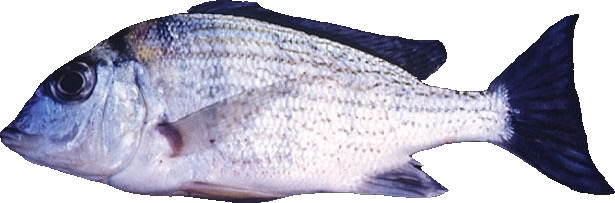

* Clean edges around the fish
* No background information
* The whole fish is preserved

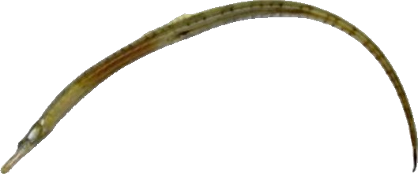

* No background information
* Although the image is low quality, the shape of the fish is preserved with no loss of major fish parts
* Images can have rough edges and low quality! As long as the rough edges do not lead to a significant cumulative loss of image data!

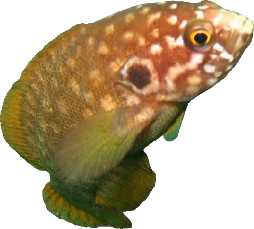

* Generally, the angle of the fish is not a problem
* The fish has clean edges, with no background information

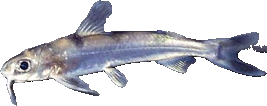

* Although, there is some loss in the fish's tail, the majority of the tail is still visible
* The rest of the fish is well-segmented

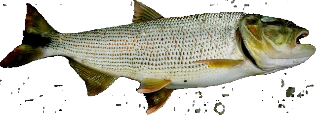

* Some background information got through, but in total it does not account for 10% or more of the final image
* There wasn't significant loss of fish data
* Sometimes, it can be difficult to tell if the amount of background is significant or not
* **If you are unsure, please rate the image as unsuccessfully segmented**

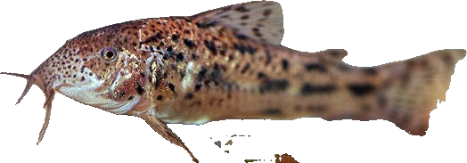

* This fish is an interesting case
* There is some slight background that got through near the bottom, but that is a minimal gain in pixels and insignificant
* The back of the fish is quite blurry and low quality, but we are not assessing quality but rather the visibility of patterns
* Some rough edges on the lower half of the fish, but they do not introduce excess background information or cause a large loss of data
* Therefore, this is a **successful segmentation**

## Unsuccessful segmentations

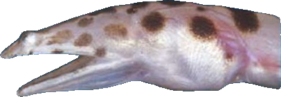

* There is clearly a huge loss of information in this image, specifically, the back half of the fish

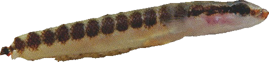

* At first look, this fish looks fairly well-segmented: clean edges, patterns are clear...
* However, the fish appears to have lost its tail
* Small losses that consist of a whole fish part result in **unsuccessful segmentation**

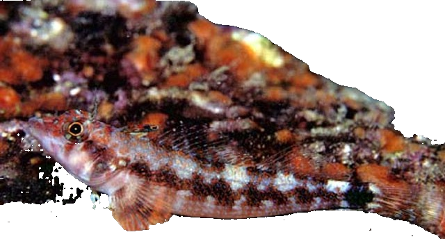

* A large portion of the segmented image consists of extraneous background image
* The background would likely affect our ability to identify fish patterns

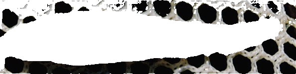

* The segmenter cut out the fish image, not the background
* There is a clear loss of fish data and a presence of significant background

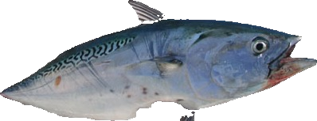

* The loss of both the tail and a whole fin means this is an **unsuccessful segmentation**

## Summary

Unsuccessfully segmented images are defined as follows:

* Failure to remove a significant portion of extraneous information or background
* Removal of a significant portion of the actual fish of focus
* Significantly rough or unclean edges around the segmented fish image

In cases where it is difficult to give a rating, please rate the image as an unsuccessful segmentation. Thank you for your help!

Protocol written by Santiago Chang @ UCLA.
